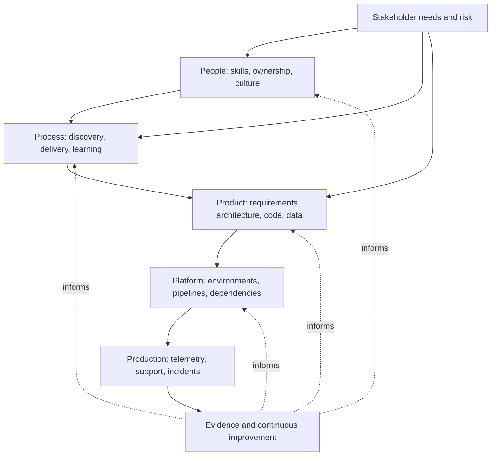

# MSQE Quality System Model

## Metadata

| Field | Value |
|---|---|
| Diagram title | MSQE Quality System Model |
| Related chapter | Chapter 1 — What Is Modern Software Quality Engineering? |
| Part | Part I — Foundations of Modern Software Quality Engineering |
| MQE-BOK domain | Domain 1 — Foundations of Modern Software Quality Engineering |
| Diagram type | Conceptual flow |
| Skill level | Foundation |
| Model status | Original MSQE teaching aid; not an industry standard |
| Version | 0.1.0 |
| Status | Draft |
| Author | MSQE Project |
| Last updated | 2026-08-08 |

## Purpose

Show that quality is engineered across a socio-technical system rather than inspected into a completed product. The model connects stakeholder needs and risk to the people, processes, product, platform, production evidence, and learning that shape a quality outcome.

## Learning Objectives

After studying this diagram, the reader should be able to:

- identify the system areas that shape software quality; and
- explain how production evidence improves earlier engineering decisions.

## Diagram Source

This Mermaid representation preserves the MSQE Quality System Model established in Chapter 1.

## Diagram

## Textual Interpretation and Accessibility

Read from the top down first: stakeholder needs and risk influence people, process, and product decisions; the product is delivered through a platform and produces production evidence. Then read the dotted arrows back upward: evidence informs changes to people, process, product, and platform. The arrows describe connected influence, not a one-way project sequence.

## Component Description

| Component | Contribution to quality |
|---|---|
| People | Apply expertise, make ownership and trade-offs explicit, and learn together. |
| Process | Creates timely opportunities for discovery, delivery, feedback, and improvement. |
| Product | Encodes requirements, architecture, code, and data decisions. |
| Platform | Supplies the environments, pipelines, and dependencies through which the product operates. |
| Production | Reveals customer impact and system behaviour under real conditions. |

## Related Chapters

- Chapter 3 — Understanding Software Quality
- Chapter 4 — Quality Throughout the Software Development Lifecycle
- Chapter 5 — Shift Left, Shift Right & Shift Everywhere

## Diagram Review Checklist

- [x] Purpose and source are clear.
- [x] Labels do not rely on colour to convey meaning.
- [x] The Mermaid source provides an accessible textual representation.

