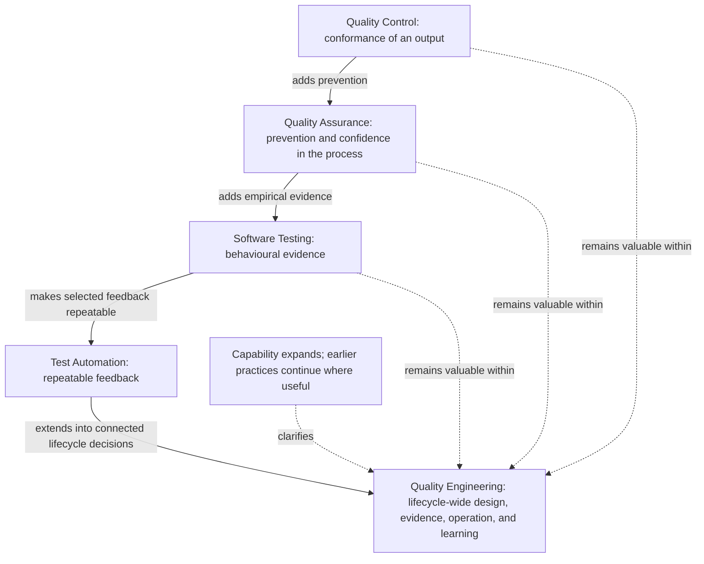

# QA to Quality Engineering Evolution

## Metadata

| Field | Value |
|---|---|
| Diagram title | QA to Quality Engineering Evolution |
| Related chapter | Chapter 2 — The Evolution from QA to Quality Engineering |
| Part | Part I — Foundations of Modern Software Quality Engineering |
| MQE-BOK domain | Domain 1 — Foundations of Modern Software Quality Engineering |
| Diagram type | Capability evolution |
| Skill level | Foundation |
| Model status | Chapter teaching visual; not a maturity model or job-title ladder |
| Version | 0.1.0 |
| Status | Draft |
| Author | MSQE Project |
| Last updated | 2026-08-08 |

## Purpose

Explain why Quality Control, Quality Assurance, software testing, test automation, and Quality Engineering emerged. The diagram shows expanding capability and feedback scope without implying that a later practice eliminates an earlier one.

## Learning Objectives

After studying this diagram, the reader should be able to:

- distinguish the primary contribution of each quality practice; and
- explain how Quality Engineering incorporates useful QC, QA, testing, and automation practices.

## Diagram Source

This Mermaid representation is based on the comparison and evolution narrative in Chapter 2.

## Diagram

## Textual Interpretation and Accessibility

The solid path reads as an expansion of the problems teams needed to solve: conformance, prevention, behavioural evidence, repeatable feedback, and finally connected lifecycle quality. The three dotted arrows state that Quality Control, Quality Assurance, and testing remain useful within Quality Engineering. The visual is not a historical replacement sequence or a maturity ranking.

## Component Description

| Practice | Primary contribution |
|---|---|
| Quality Control | Checks whether an output meets agreed criteria. |
| Quality Assurance | Improves confidence that the system of work can prevent recurring problems. |
| Software Testing | Obtains evidence about behaviour under stated conditions. |
| Test Automation | Makes selected checks repeatable, timely, and diagnosable. |
| Quality Engineering | Connects these practices to discovery, design, delivery, operations, and improvement. |

## Related Chapters

- Chapter 1 — What Is Modern Software Quality Engineering?
- Chapter 4 — Quality Throughout the Software Development Lifecycle
- Chapter 8 — The Modern Quality Engineer

## Diagram Review Checklist

- [x] Earlier practices are shown as continuing contributions.
- [x] Labels distinguish the practices by purpose rather than title.
- [x] The Mermaid source provides an accessible textual representation.
