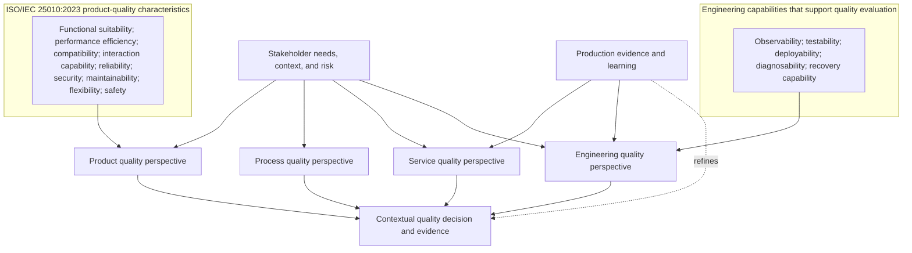

# Software Quality Perspectives

## Metadata

| Field | Value |
|---|---|
| Diagram title | Software Quality Perspectives |
| Related chapter | Chapter 3 — Understanding Software Quality |
| Part | Part I — Foundations of Modern Software Quality Engineering |
| MQE-BOK domain | Domain 1 — Foundations of Modern Software Quality Engineering |
| Diagram type | Conceptual relationship map |
| Skill level | Foundation |
| Model status | Chapter teaching visual; ISO/IEC 25010 concepts are identified separately from MSQE teaching terms |
| Version | 0.1.0 |
| Status | Draft |
| Author | MSQE Project |
| Last updated | 2026-08-08 |

## Purpose

Help readers reason about software quality from multiple connected perspectives. The diagram makes a formal distinction between ISO/IEC 25010:2023 product-quality characteristics and engineering capabilities that help a team achieve and evaluate quality.

## Learning Objectives

After studying this diagram, the reader should be able to:

- distinguish product, process, service, and engineering quality perspectives; and
- explain why observability and testability support quality without being ISO/IEC 25010 product-quality characteristics.

## Diagram Source

The product-quality characteristics and the perspective distinctions follow Chapter 3. ISO/IEC 25010:2023 is an established standard; the perspective grouping is an MSQE teaching model.

## Diagram

## Textual Interpretation and Accessibility

Start with stakeholder needs, context, and risk. Product, process, service, and engineering perspectives each contribute evidence to a contextual quality decision. The top subgraph is explicitly limited to the nine ISO/IEC 25010:2023 product-quality characteristics. The second subgraph contains engineering capabilities such as observability and testability; it is separate because those capabilities support evaluation and operation but are not additional ISO product-quality characteristics. Production evidence informs service and engineering perspectives and refines future decisions.

## Component Description

| Component | Meaning |
|---|---|
| Product quality | Properties of the product or system itself. |
| Process quality | Effectiveness of the way work is performed and improved. |
| Service quality | Quality experienced while the service is used and supported. |
| Engineering quality | Sustained ability to design, change, deliver, operate, and learn safely. |
| Engineering capabilities | Capabilities that help teams create and assess quality evidence. |

## Related Chapters

- Chapter 1 — What Is Modern Software Quality Engineering?
- Chapter 4 — Quality Throughout the Software Development Lifecycle
- Chapter 9 — The Modern Software Quality Engineering Framework

## Diagram Review Checklist

- [x] ISO/IEC 25010 product-quality characteristics are explicitly separated from engineering capabilities.
- [x] No meaning depends on colour.
- [x] The Mermaid source and textual interpretation provide an accessible alternative.

