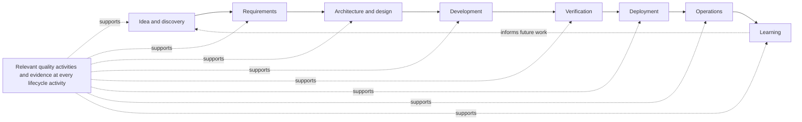

# Quality Throughout the Software Development Lifecycle

## Metadata

| Field | Value |
|---|---|
| Diagram title | Quality Throughout the Software Development Lifecycle |
| Related chapter | Chapter 4 — Quality Throughout the Software Development Lifecycle |
| Part | Part I — Foundations of Modern Software Quality Engineering |
| MQE-BOK domain | Domain 1 — Foundations of Modern Software Quality Engineering |
| Diagram type | Lifecycle flow |
| Skill level | Foundation |
| Model status | Original MSQE lifecycle teaching framing; not an ISO or IEEE process definition |
| Version | 0.1.0 |
| Status | Draft |
| Author | MSQE Project |
| Last updated | 2026-08-08 |

## Purpose

Show where quality engineering happens: from idea and discovery through operation and learning. The visual emphasises lifecycle coverage and the presence of useful evidence at every activity.

## Learning Objectives

After studying this diagram, the reader should be able to:

- identify lifecycle points where a Quality Engineer can influence a decision; and
- explain why operational learning must inform future discovery and planning.

## Diagram Source

This Mermaid representation follows Chapter 4's modern software delivery lifecycle. It deliberately focuses on where quality work occurs; Chapter 5 separately explains the Continuous Quality Loop and when evidence changes decisions.

## Diagram

## Textual Interpretation and Accessibility

The main path names the lifecycle activities: idea and discovery, requirements, architecture and design, development, verification, deployment, operations, and learning. The dotted evidence node applies to every activity, not only verification. The dotted arrow from learning to idea shows that lifecycle work is iterative and that an operational finding should influence a future decision.

## Component Description

| Lifecycle activity | Typical quality contribution |
|---|---|
| Idea and discovery | Clarify customer outcomes, consequences of failure, and initial uncertainty. |
| Requirements and design | Make quality expectations, trade-offs, testability, and observability explicit. |
| Development and verification | Produce focused implementation and integration evidence. |
| Deployment and operations | Introduce change safely, observe customer impact, and recover from unexpected conditions. |
| Learning | Turn evidence into a change to future requirements, design, or delivery practice. |

## Related Chapters

- Chapter 1 — What Is Modern Software Quality Engineering?
- Chapter 5 — Shift Left, Shift Right & Shift Everywhere
- Chapter 6 — Systems Thinking for Quality Engineers

## Diagram Review Checklist

- [x] Lifecycle coverage is distinguished from the Continuous Quality Loop.
- [x] The model does not require a linear delivery method.
- [x] The Mermaid source provides an accessible textual representation.

