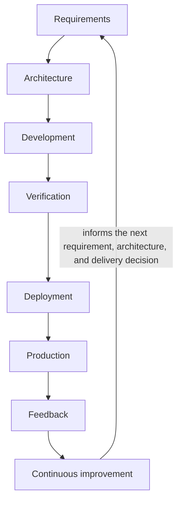

# Continuous Quality Loop

## Metadata

| Field | Value |
|---|---|
| Diagram title | Continuous Quality Loop |
| Related chapter | Chapter 5 — Shift Left, Shift Right & Shift Everywhere |
| Part | Part I — Foundations of Modern Software Quality Engineering |
| MQE-BOK domain | Domain 1 — Foundations of Modern Software Quality Engineering |
| Diagram type | Feedback loop |
| Skill level | Foundation |
| Model status | Original MSQE Educational Model; not an industry standard |
| Version | 0.1.0 |
| Status | Draft |
| Author | MSQE Project |
| Last updated | 2026-08-08 |

## Purpose

Make the timing and movement of quality evidence visible across delivery and operation. The Continuous Quality Loop explains how Shift Left, Shift Right, and Shift Everywhere connect rather than compete.

## Learning Objectives

After studying this diagram, the reader should be able to:

- identify where evidence is acquired throughout the loop; and
- explain when a feedback loop is complete: when evidence changes a future engineering decision.

## Diagram Source

This Mermaid representation follows the original MSQE Continuous Quality Loop defined in Chapter 5.

## Diagram

## Textual Interpretation and Accessibility

Read the loop from Requirements through Continuous Improvement. Each element creates or uses evidence: requirements establish outcomes and risk; architecture chooses controls; development and verification provide implementation evidence; deployment and production reveal target-environment and customer evidence; feedback interprets it; and continuous improvement changes a future decision. The final arrow back to Requirements makes the model a loop rather than a release pipeline.

## Component Description

| Loop element | Quality purpose |
|---|---|
| Requirements and architecture | Establish outcomes, constraints, risks, controls, and trade-offs. |
| Development and verification | Create local, integration, exploratory, performance, security, and other relevant evidence. |
| Deployment and production | Confirm target-state behaviour and learn from real users, data, dependencies, and workload. |
| Feedback and continuous improvement | Interpret evidence and improve the next decision and delivery system. |

## Related Chapters

- Chapter 4 — Quality Throughout the Software Development Lifecycle
- Chapter 6 — Systems Thinking for Quality Engineers
- Chapter 10 — The Future of Quality Engineering

## Diagram Review Checklist

- [x] The canonical model name and sequence are preserved.
- [x] The return arrow states the purpose of feedback.
- [x] The Mermaid source provides an accessible textual representation.
