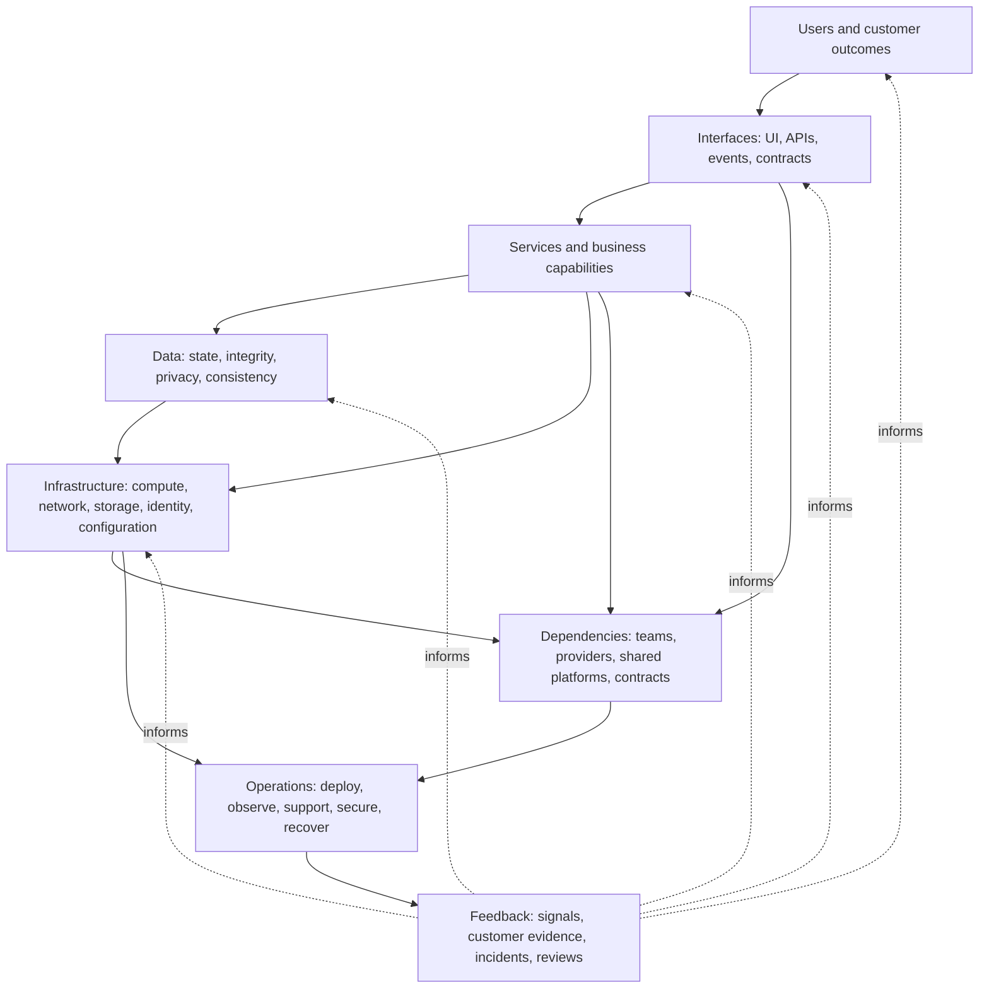

# Quality System Map

## Metadata

| Field | Value |
|---|---|
| Diagram title | Quality System Map |
| Related chapter | Chapter 6 — Systems Thinking for Quality Engineers |
| Part | Part I — Foundations of Modern Software Quality Engineering |
| MQE-BOK domain | Domain 1 — Foundations of Modern Software Quality Engineering |
| Diagram type | System relationship map |
| Skill level | Foundation |
| Model status | Original MSQE Educational Model; not an industry-standard architecture notation |
| Version | 0.1.0 |
| Status | Draft |
| Author | MSQE Project |
| Last updated | 2026-08-08 |

## Purpose

Give Quality Engineers a repeatable way to widen a discussion from a feature to the system conditions that shape a user outcome. The map supports system-level reasoning about interactions, dependencies, operation, and feedback.

## Learning Objectives

After studying this diagram, the reader should be able to:

- identify the system layers and relationships relevant to a customer outcome; and
- trace how feedback from operation can change earlier decisions.

## Diagram Source

This Mermaid representation follows the original MSQE Quality System Map defined in Chapter 6. It is a discussion lens, not a strict linear architecture or a replacement for formal modelling techniques.

## Diagram

## Textual Interpretation and Accessibility

Begin with users and the outcome they need. Interfaces carry the flow to services, which use data and infrastructure. Dependencies influence interfaces, services, and infrastructure; operations deploys, observes, supports, secures, and recovers the system. Feedback from signals, users, incidents, and reviews informs earlier layers. The diagram is intentionally not a linear architecture: its additional dependency and feedback arrows highlight interactions a component-only view can miss.

## Component Description

| Map layer | Question it prompts |
|---|---|
| Users | What outcome matters, who can be harmed, and how will failure be perceived? |
| Interfaces and services | Which flows, contracts, business capabilities, and failure semantics shape the outcome? |
| Data and infrastructure | Which state, configuration, capacity, identity, and consistency conditions support the flow? |
| Dependencies and operations | Which suppliers, teams, response paths, and recovery conditions affect the outcome? |
| Feedback | Which evidence changes a future design or delivery decision? |

## Related Chapters

- Chapter 4 — Quality Throughout the Software Development Lifecycle
- Chapter 5 — Shift Left, Shift Right & Shift Everywhere
- Chapter 9 — The Modern Software Quality Engineering Framework

## Diagram Review Checklist

- [x] The model is labelled as an MSQE educational model.
- [x] Relationships do not imply a fixed system architecture.
- [x] The Mermaid source and textual interpretation provide an accessible alternative.

