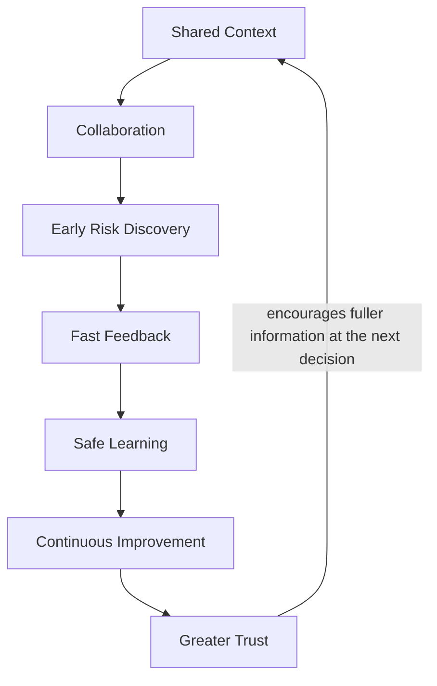

# Quality Culture Flywheel

## Metadata

| Field | Value |
|---|---|
| Diagram title | Quality Culture Flywheel |
| Related chapter | Chapter 7 — Engineering Culture & DevOps Mindset |
| Part | Part I — Foundations of Modern Software Quality Engineering |
| MQE-BOK domain | Domain 1 — Foundations of Modern Software Quality Engineering |
| Diagram type | Reinforcing feedback loop |
| Skill level | Foundation |
| Model status | Original MSQE Educational Model; not an industry standard or maturity assessment |
| Version | 0.1.0 |
| Status | Draft |
| Author | MSQE Project |
| Last updated | 2026-08-08 |

## Purpose

Show how the team behaviours that support quality reinforce one another over time. The flywheel is a cultural model, not a one-time delivery process or a scorecard.

## Learning Objectives

After studying this diagram, the reader should be able to:

- explain the reinforcing relationship between collaboration, feedback, learning, and trust; and
- identify a point where a team can interrupt an unhealthy cultural pattern.

## Diagram Source

This Mermaid representation follows the original MSQE Quality Culture Flywheel defined in Chapter 7.

## Diagram

## Textual Interpretation and Accessibility

Shared context enables collaboration. Collaboration exposes risk earlier. Early risk discovery permits fast feedback; fast feedback supports safe learning; safe learning enables continuous improvement; and repeated improvement builds greater trust. Greater trust feeds back to shared context because people are more likely to surface useful information. The loop can also run in reverse when blame, hidden risk, slow feedback, or ignored findings reduce trust.

## Component Description

| Flywheel stage | Meaning |
|---|---|
| Shared Context | The team understands the outcome, risk, constraints, roles, and evidence needed for a decision. |
| Collaboration | Relevant perspectives work across functional boundaries. |
| Early Risk Discovery and Fast Feedback | The team surfaces assumptions early and receives useful evidence while it can act. |
| Safe Learning and Continuous Improvement | People examine outcomes constructively and change the product, process, platform, or capability. |
| Greater Trust | Follow-through makes future concerns easier to raise and address. |

## Related Chapters

- Chapter 1 — What Is Modern Software Quality Engineering?
- Chapter 5 — Shift Left, Shift Right & Shift Everywhere
- Chapter 8 — The Modern Quality Engineer

## Diagram Review Checklist

- [x] The canonical model name and reinforcing return are preserved.
- [x] The diagram communicates a pattern of behaviour rather than a process mandate.
- [x] The Mermaid source provides an accessible textual representation.
