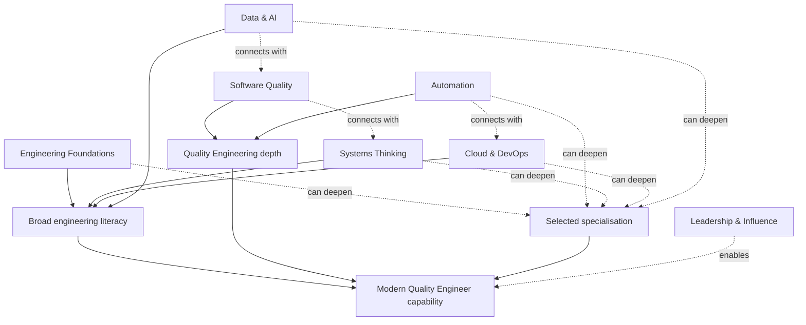

# Quality Engineer Competency Model

## Metadata

| Field | Value |
|---|---|
| Diagram title | Quality Engineer Competency Model |
| Related chapter | Chapter 8 — The Modern Quality Engineer |
| Part | Part I — Foundations of Modern Software Quality Engineering |
| MQE-BOK domain | Domain 1 — Foundations of Modern Software Quality Engineering |
| Diagram type | Competency relationship map |
| Skill level | Foundation |
| Model status | Original MSQE Educational Model; not a job standard, certification syllabus, or universal sequence |
| Version | 0.1.0 |
| Status | Draft |
| Author | MSQE Project |
| Last updated | 2026-08-08 |

## Purpose

Show the connected competency categories a Modern Quality Engineer may develop. The model communicates broad engineering literacy, Quality Engineering depth, and selected specialisation without prescribing a single career path.

## Learning Objectives

After studying this diagram, the reader should be able to:

- identify the seven connected competency categories; and
- plan development as a balanced profile rather than a fixed sequence of tools or titles.

## Diagram Source

This Mermaid representation follows the original MSQE Quality Engineer Competency Model defined in Chapter 8.

## Diagram

## Textual Interpretation and Accessibility

The centre represents Modern Quality Engineer capability. It is supported by broad engineering literacy, Quality Engineering depth, and selected specialisation. The seven named categories contribute in different ways: Engineering Foundations, Systems Thinking, Cloud & DevOps, and Data & AI broaden literacy; Software Quality and Automation deepen QE practice; categories such as automation, systems, cloud, and data and AI can become specialisations; and Leadership & Influence enables contribution across the model. The dotted connections show overlap, not a required progression.

## Component Description

| Competency category | Focus |
|---|---|
| Engineering Foundations | Programming, version control, APIs, databases, architecture basics, and delivery practices. |
| Software Quality and Automation | Risk, test strategy, investigation, evidence, maintainable checks, pipelines, and tooling. |
| Systems Thinking and Cloud & DevOps | Dependencies, resilience, observability, delivery safety, monitoring, incident learning, and flow. |
| Data & AI | Data quality, analytics, privacy, AI-assisted systems, evaluation, and governance awareness. |
| Leadership & Influence | Communication, facilitation, coaching, prioritisation, culture, and strategic judgement. |

## Related Chapters

- Chapter 2 — The Evolution from QA to Quality Engineering
- Chapter 6 — Systems Thinking for Quality Engineers
- Chapter 10 — The Future of Quality Engineering

## Diagram Review Checklist

- [x] The model does not imply that competency development is strictly linear.
- [x] Broad literacy, QE depth, and specialisation are explicit.
- [x] The Mermaid source and textual interpretation provide an accessible alternative.
