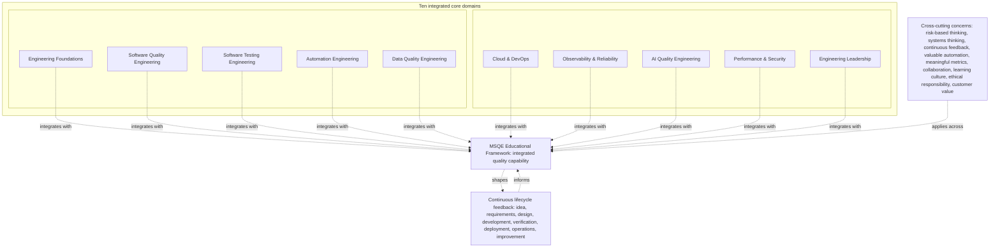

# Modern Software Quality Engineering Framework

## Metadata

| Field | Value |
|---|---|
| Diagram title | Modern Software Quality Engineering Framework |
| Related chapter | Chapter 9 — The Modern Software Quality Engineering Framework |
| Part | Part I — Foundations of Modern Software Quality Engineering |
| MQE-BOK domain | Domain 1 — Foundations of Modern Software Quality Engineering |
| Diagram type | Integrated capability framework |
| Skill level | Foundation |
| Model status | Original MSQE Educational Framework; not an industry standard, maturity model, or certification standard |
| Version | 0.1.0 |
| Status | Draft |
| Author | MSQE Project |
| Last updated | 2026-08-08 |

## Purpose

Provide the canonical conceptual representation of the MSQE Educational Framework. It shows that quality outcomes depend on complementary engineering disciplines, connected by cross-cutting principles and continuous lifecycle feedback rather than isolated silos.

## Learning Objectives

After studying this diagram, the reader should be able to:

- name the ten core domains and explain why they must work together; and
- distinguish the original MSQE Educational Framework from a standard, maturity model, certification scheme, or team structure.

## Diagram Source

This Mermaid representation follows the original MSQE Educational Framework defined in Chapter 9: ten core domains, cross-cutting concerns, and lifecycle integration.

## Diagram

## Textual Interpretation and Accessibility

The central node is the **MSQE Educational Framework**, an original teaching model. The two rows enumerate its ten integrated core domains: Engineering Foundations; Software Quality Engineering; Software Testing Engineering; Automation Engineering; Data Quality Engineering; Cloud & DevOps; Observability & Reliability; AI Quality Engineering; Performance & Security; and Engineering Leadership. Every domain has a dotted integration relationship with the central framework; this does not indicate ownership, hierarchy, or a required order. Cross-cutting concerns apply across all domains. Continuous lifecycle feedback both informs and is shaped by the integrated capability.

## Component Description

| Component | Role in the framework |
|---|---|
| Ten core domains | Make the major engineering capability areas discussable without assigning them to fixed teams or job titles. |
| Cross-cutting concerns | Connect domain work through risk, systems thinking, evidence, collaboration, learning, ethics, and customer value. |
| Lifecycle feedback | Connects idea, requirements, design, delivery, operation, and improvement so evidence can change decisions. |
| Central framework | Provides a shared educational map; it does not score or certify an organisation. |

## Related Chapters

- Chapter 3 — Understanding Software Quality
- Chapter 6 — Systems Thinking for Quality Engineers
- Chapter 8 — The Modern Quality Engineer
- Chapter 10 — The Future of Quality Engineering

## Diagram Review Checklist

- [x] All ten approved core domains are included.
- [x] The original framework is explicitly distinguished from standards and maturity models.
- [x] Labels and relationships do not rely on colour.
- [x] The Mermaid source and textual interpretation provide an accessible alternative.
