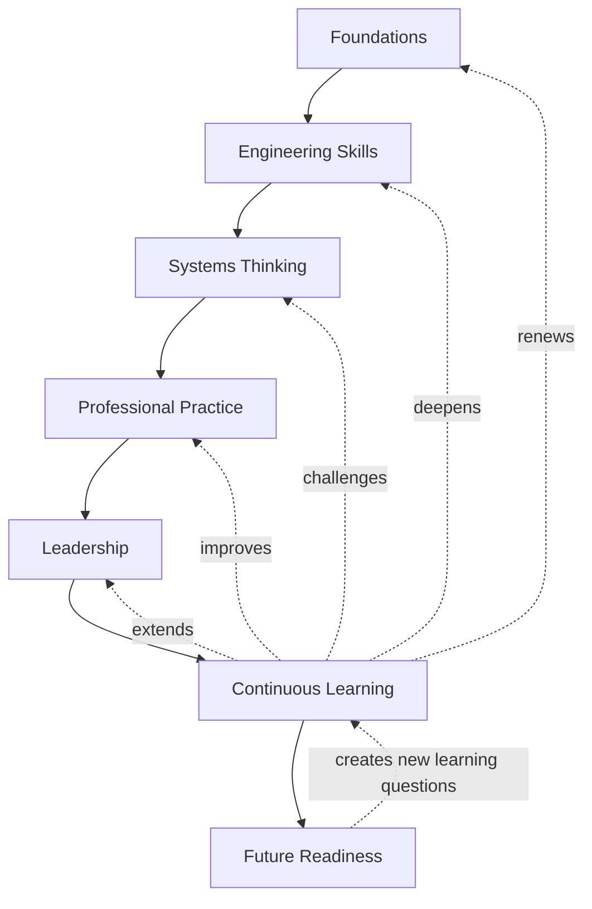

# Continuous Quality Engineering Journey

## Metadata

| Field | Value |
|---|---|
| Diagram title | Continuous Quality Engineering Journey |
| Related chapter | Chapter 10 — The Future of Quality Engineering |
| Part | Part I — Foundations of Modern Software Quality Engineering |
| MQE-BOK domain | Domain 1 — Foundations of Modern Software Quality Engineering |
| Diagram type | Professional-development feedback journey |
| Skill level | Foundation |
| Model status | Original MSQE Educational Model; not an industry standard, career ladder, maturity model, or required sequence |
| Version | 0.1.0 |
| Status | Draft |
| Author | MSQE Project |
| Last updated | 2026-08-08 |

## Purpose

Show professional development as continuous extension of capability toward future readiness. The journey is deliberately not a career endpoint: continuous learning can strengthen or revisit every stage.

## Learning Objectives

After studying this diagram, the reader should be able to:

- identify the seven development focuses in the Continuous Quality Engineering Journey; and
- explain why a Quality Engineer may revisit foundations or technical skills at any stage of a career.

## Diagram Source

This Mermaid representation follows the original MSQE Continuous Quality Engineering Journey defined in Chapter 10.

## Diagram

## Textual Interpretation and Accessibility

The solid path gives a useful development sequence: Foundations, Engineering Skills, Systems Thinking, Professional Practice, Leadership, Continuous Learning, and Future Readiness. Dotted arrows from Continuous Learning show that learning can renew foundations, deepen skills, challenge systems thinking, improve professional practice, and extend leadership. Future Readiness creates new learning questions. The journey is therefore a continuous developmental cycle, not a mandatory title sequence or a destination.

## Component Description

| Journey stage | Development focus |
|---|---|
| Foundations | Quality as a system property, core testing, risk, and engineering concepts. |
| Engineering Skills | Programming, testing, automation, APIs, data, delivery, and diagnostics. |
| Systems Thinking and Professional Practice | Boundaries, dependencies, evidence, communication, ethics, and collaboration in real decisions. |
| Leadership | Mentoring, facilitation, reusable capability, and constructive challenge. |
| Continuous Learning and Future Readiness | Adapt practice to feedback and evaluate emerging capabilities responsibly. |

## Related Chapters

- Chapter 2 — The Evolution from QA to Quality Engineering
- Chapter 8 — The Modern Quality Engineer
- Chapter 9 — The Modern Software Quality Engineering Framework

## Diagram Review Checklist

- [x] The canonical model name and stages are preserved.
- [x] Continuous learning visibly returns to earlier capability areas.
- [x] The Mermaid source and textual interpretation provide an accessible alternative.
