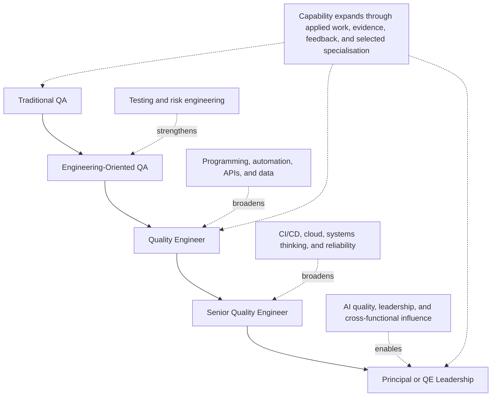

# QA to Quality Engineering Transition Journey

## Metadata

| Field | Value |
|---|---|
| Diagram title | QA to Quality Engineering Transition Journey |
| Related document | QA to Quality Engineering Transition Framework |
| Part | Cross-handbook learning asset |
| MQE-BOK domain | Domain 1 — Foundations of Modern Software Quality Engineering |
| Diagram type | Capability progression map |
| Skill level | Foundation |
| Model status | MSQE educational guidance; not a job-title ladder or universal career path |
| Version | 0.1.0 |
| Status | Draft |
| Author | MSQE Project |
| Last updated | 2026-08-08 |

## Purpose

Make the MSQE mission immediately understandable: experienced QA Engineers extend their existing strengths into Modern Quality Engineering capability. The visual depicts a typical progression while making clear that job titles vary and the path is neither mandatory nor strictly linear.

## Learning Objectives

After studying this diagram, the reader should be able to:

- explain the difference between a capability progression and a prescribed job-title sequence; and
- identify the engineering and professional capabilities that broaden a QA contribution into Quality Engineering.

## Diagram Source

This Mermaid representation follows the QA to Quality Engineering Transition Framework in `docs/00-project/QA_TO_QE_TRANSITION_FRAMEWORK.md`.

## Diagram

## Textual Interpretation and Accessibility

The solid vertical path shows a typical expansion of contribution from Traditional QA to Engineering-Oriented QA, Quality Engineer, Senior Quality Engineer, and Principal or QE Leadership. It is a capability progression, not a mandatory ladder: a person may keep a QA, SDET, automation, or Quality Engineer title while developing these capabilities. Dotted arrows show the expansion from testing and risk into programming, automation, APIs, data, CI/CD, cloud, systems thinking, reliability, AI quality, leadership, and cross-functional influence. Applied work, evidence, feedback, and selected specialisation are relevant throughout.

## Component Description

| Capability group | Contribution to the transition |
|---|---|
| Testing and risk engineering | Preserves the QA strengths of investigation, user advocacy, test design, and risk communication. |
| Engineering contribution | Adds programming, automation, APIs, and data capability for building and diagnosing quality feedback. |
| Delivery-system contribution | Adds CI/CD, cloud, systems thinking, and reliability reasoning across the operating system of work. |
| Professional contribution | Adds AI quality, leadership, facilitation, and influence to improve team decisions and capability. |

## Related Chapters

- Chapter 2 — The Evolution from QA to Quality Engineering
- Chapter 8 — The Modern Quality Engineer
- Chapter 10 — The Future of Quality Engineering

## Diagram Review Checklist

- [x] The progression is explicitly described as capability-based, not title-based.
- [x] The visual contains a readable capability expansion rather than a full competency matrix.
- [x] The Mermaid source and textual interpretation provide an accessible alternative.
