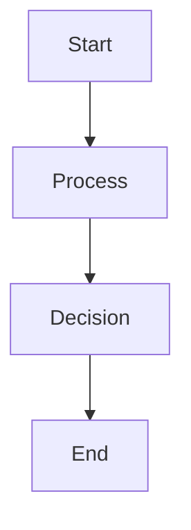

# Diagram Template

---

## Metadata

| Field | Value |
|-------|-------|
| Diagram Title | |
| Chapter | |
| Part | |
| MQE-BOK Domain | |
| Diagram Type | Architecture / Sequence / Flow / State / Deployment / Data Model / Component / Decision Tree |
| Skill Level | Foundation / Intermediate / Advanced |
| Version | |
| Status | Draft / Review / Published |
| Author | |
| Last Updated | |

---

# Purpose

Describe the purpose of this diagram.

Explain what problem it helps solve and why it is important to understanding the chapter.

---

# Learning Objectives

After studying this diagram, the reader should be able to:

- Explain...
- Identify...
- Describe...
- Apply...

---

# Context

Describe where this diagram fits within the chapter and the software engineering lifecycle.

---

# Diagram

> Insert Mermaid diagram, PlantUML, SVG, or image.

---

# Component Description

| Component | Description |
|------------|-------------|
| | |
| | |
| | |

---

# Engineering Perspective

Explain how this design is implemented in modern software systems.

Include examples where appropriate.

---

# Quality Engineering Perspective

Discuss:

- Testability
- Reliability
- Scalability
- Observability
- Security
- Performance
- Maintainability

---

# Common Mistakes

- Mistake 1
- Mistake 2
- Mistake 3

---

# Best Practices

- Best Practice 1
- Best Practice 2
- Best Practice 3

---

# Related Chapters

- Chapter X
- Chapter Y

---

# References

-
-
-

---

# Diagram Review Checklist

- [ ] Purpose clearly explained
- [ ] Diagram readable
- [ ] Components labelled
- [ ] Industry terminology used
- [ ] Engineering perspective included
- [ ] Quality considerations included
- [ ] References provided